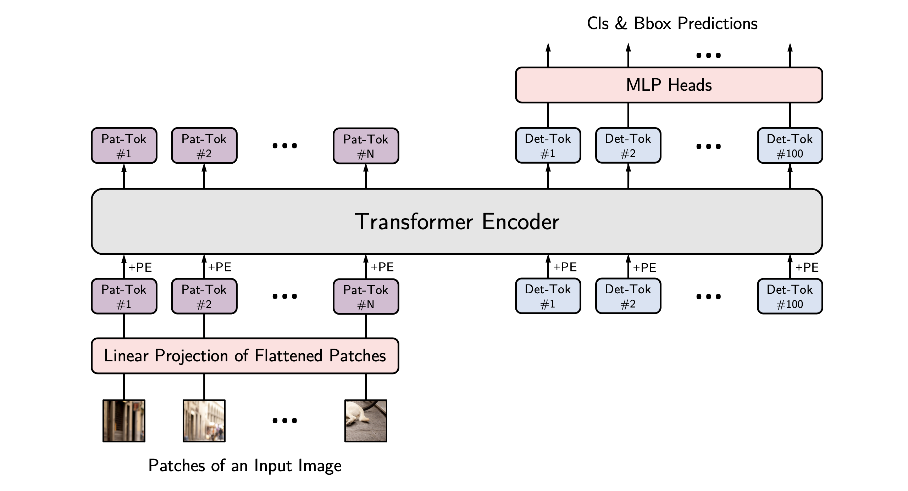
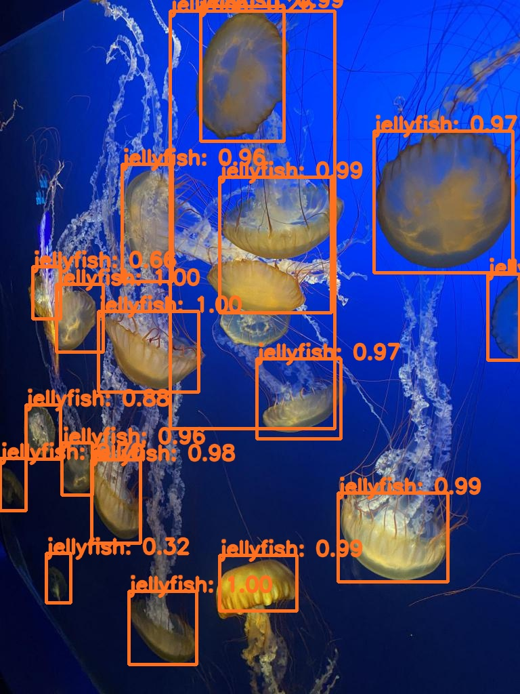
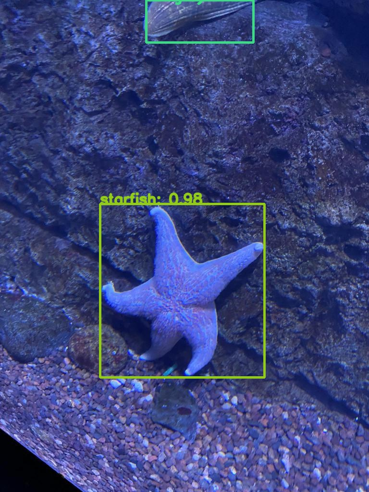
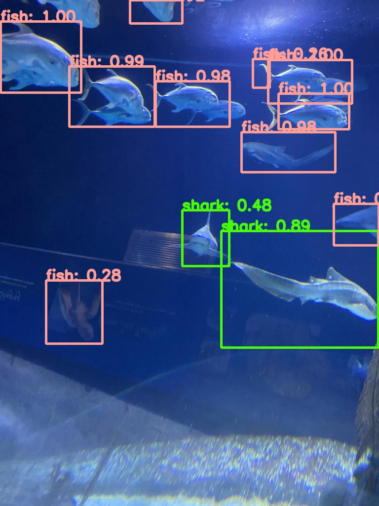

# YOLOS
## Objecet detection using Vision Transformer Models.
### Quick intro: YOLOS
YOLOS is short for ***You Only Look at One Sequence***, and simply consists of Vision Transformer (ViT) as encoder (taking in a sequence of patches and a sequence of detection tokens, also called "queries"), with object detection heads on top. The model is trained in similar fashion to DETR, using a clever loss function, the so-called bipartite matching loss. I highly recommend [Yannic Kilcher's video](https://www.youtube.com/watch?v=T35ba_VXkMY&t=1693s)! if you want to understand how DETR (and, in turn, YOLOS) work.



### Setting up the environments

step 1: Create the new python environment using following command

		conda create -n <environment_name> python=3.7

step 2: Once new environment created activate using following command

		conda activate <environment_name>

step 3: Once environment is activate using requirements.txt to install all packages using following command

		pip install -r requirements.txt
    
### Available Models
  
| Model Name      | MAP |
| :---------: | :---------: |
| [yolos-tiny](https://huggingface.co/hustvl/yolos-tiny)            | 28.7     |
| [yolos-small](https://huggingface.co/hustvl/yolos-small)          | 36.1     |
| [yolos-small-300](https://huggingface.co/hustvl/yolos-small-300)  | 36.1     |
| [yolos-small-dwr](https://huggingface.co/hustvl/yolos-small-dwr)  | 37.6     |
| [yolos-base](https://huggingface.co/hustvl/yolos-base)            | 42       |


### Data preparation

YOLOS required annotation in COCO format to train a model using a custom dataset. If you have annotations in another format, you may use [Annotation_Converter](https://github.com/k1anshul/Annotation-Converter) to convert them. COCO, VOC, and YOLO formats are currently supported. We expect the following directory structure:
  
```
├──dataset/
      │ 
      ├── train/
      │   ├── _annotations.coco.json
      │   ├── image1.jpg
      │   └── image2.jpg ...
      ├── valid/
      │   ├── _annotations.coco.json
      │   ├── image3.jpg
      │   └── image4.jpg ...
      ├── test/
      │   ├── _annotations.coco.json
      │   ├── image5.jpg
      │   └── image6.jpg ...
```

### Training

Set training hyperparameters in hyp _train.yaml from the config folder before starting model training. Details about hypterparameters are mentioned in the same config file. W&B will have access to all training logs. Once the relevant hyperparameters are configured, execute the following command to begin model training:
```
    python train.py
```

### Inference & Evaluation

Once the model has been trained, use the pretrained model to validate it on test or valid data using eval.py, and if satisfied with the MAP, get predictions on images using the inference.py file. The respective config file contains information regarding hypterparameters. After configuring the required hyperparameters, use the following command to start model evaluation and inference:

```
    python eval.py
```

```
    python inference.py
```

### Prediction

The predictions from a custom dataset trained on Aquatic Life are shown here. [Aquarium_Dataset](https://public.roboflow.com/ds/AmFElQ6mVE?key=PlQraiiQQ9), which contains six different kinds of aquatic life, was used for model training.

  
